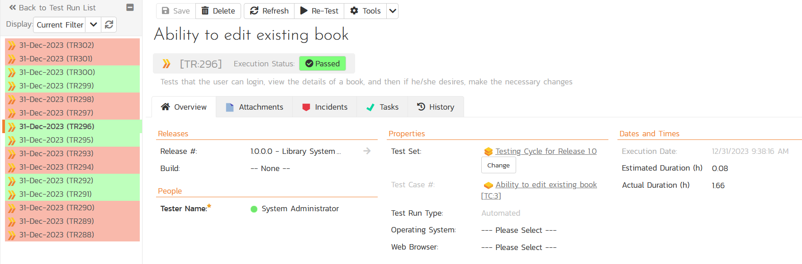

# Robot Framework Integration for Spira
This repository contains the source code for the integration between Robot Framework and the Inflectra Spira platform. This plugin lets you execute Robot Framework test suites, and have the results automatically transmitted back to Spira. It can be run locally or as part of a CI/CD pipeline.

## About Robot Framework
[Robot Framework](https://robotframework.org/) is a generic open source automation framework. It can be used for test automation and robotic process automation (RPA).

Robot Framework is supported by Robot Framework Foundation. Many industry-leading companies use the tool in their software development.


## About Spira
Spira is the end-to-end platform from [Inflectra](https://www.inflectra.com) for product creation, from idea to release. Whether you are building software yourself, or deploying third-party systems, Spira is the integrated hub into which you can plug in specialized tools for the rest of the software development lifecycle. 

Spira comes in three flavors:
- [SpiraTest](https://www.inflectra.com/SpiraTest/), powerful requirements and test management
- [SpiraTeam](https://www.inflectra.com/SpiraTeam/), agile planning and test management for teams
- [SpiraPlan](https://www.inflectra.com/SpiraPlan/), enterprise planning and testing platform

## Installing the Integration
This section outlines how to install the Spira plugin for Robot Framework. It assumes that you already have a working installation of Spira v6.0 or later. If you have an earlier version of Spira you will need to upgrade to at least v6.0 before trying to use this plugin. You will also need to have Python (with pip) and Robot Framework installed.

To obtain the latest version of the plugin, simply run the following command:

`pip install spira-robot-framework`

This command will install the latest version of the plugin straight from the Python Package Index (PyPI). Once the Spira plugin is successfully installed, all you need to do is configure the plugin, annotate your Robot Framework test cases with Spira-specific tags, then you can begin testing!

## Using the Integration
The integration consists of a Python module called `robot_spira_integration.py` that is executed after your Robot Framework tests are executed. This module will read the resulsts of the Robot Framework `output.xml` report file and send the results to Spira, mapping each Robot Framework test case to a matching Spira test case.

### Configuring the Spira connection
In your test root folder (the folder you have your Robot Framework tests),
create a file named `spira.cfg` with the following:

```cfg
[credentials]
# Following are required

url = https://myserver/spiraservice.net
username = fredbloggs
token = {XXXXXXXX-XXXX-XXXX-XXXX-XXXXXXXXXXXXX}
project_id = 1

# Following are optional:
release_id = 5
test_set_id = 1
```

For the plugin to work, you must have the following in the credentials group:

- **url** -- The base url to your Spira installation, without a '/' at
the end.

- **username** -- The username you use to sign into Spira.

- **token** -- Your API Key / RSS Token. Found in your profile page as the "RSS
Token" field, you must have RSS Feeds enabled for this to work.

- **project_id** -- The ID of the project you would like the test runs to
be sent to

- **release_id** -- OPTIONAL -- Use if you would like to associate the
test run with a release.

- **test_set_id** -- OPTIONAL -- Use if you would like to associate the
test run with a test set.

### Tagging the Test Cases
Next, you need to tag each of your Robot Framework test cases with the appropriate Spira test case id (prefixed by TC:). For example, if you had this sample Robot Framework test:

```py
Simple Test Case
    [Documentation]    Shows some assertion keywords
    Should Be Title Case    Robot Framework
    Should Be Equal    Text123    Text123
    Should Be True    5 + 5 == 10
```

You can add the Spira test case ID (TC:2 for example), simply by adding it as one of the Robot Framework test case **tags**:

```py
Simple Test Case
    [Documentation]    Shows some assertion keywords
    [Tags]    TC:2
    Should Be Title Case    Robot Framework
    Should Be Equal    Text123    Text123
    Should Be True    5 + 5 == 10
```
You should then repeat this for all of the other test cases in the test suite. Note: please make sure that all of the test case IDs are inside the Spira project ID you specified earlier in the `spira.cfg` file.

### Executing the Tests
Now you are ready to execute your tests and send the results back so Spira. This happens in two steps:
- Execute the tests and generate the `output.xml` report file
- Parse the `output.xml` report file and send the results to Spira

First run your tests using the standard `robot` command. For example, if we were executing the supplied sample test `tests.robot` you would use:

`robot tests.robot`

OR

`python -m robot tests.robot`

Next, you need to run the Spira results parser module `robot_spira_integration_py` to upload the results to Spira. For example, with the sample tests you can use either:

`python robot_spira_integration.py`

OR

`python robot_spira_integration.py Output.xml spira.cfg`

The second version lets you specify the location of the output file and the Spira configuration file. It's syntax is:

`python robot_spira_integration.py <Output File> <Spira Config File>`

Once that is done, you should see something like:

```
Sending test results to Spira at URL 'https://myserver/spiraservice.net'.
Successfully reported 4 test cases to Spira.
```

If there are any errors or warnings, they will be displayed instead.

### Viewing the Results
Finally, to view the results in Spira, you can go to the **Test Runs** tab to see the list of test runs:


If you click on one of the **passed** test runs, it will display the name of the test case from Robot Framework, together with the status (pass), the test set, release and actual duration:



If you scroll down to the **Console Output** section, it displays the full name and path of the Robot Framework test case as well as the contents of the **Documentation** attribute and any messages.


If you click on one of the **failed** test runs, it will display the name of the test case from Robot Framework, together with the status (fail), the test set, release and actual duration:


If you scroll down to the **Console Output** section, it displays the full name and path of the Robot Framework test case as well as the contents of the **Documentation** attribute and in this case, the details of what caused the test to fail:


Congratulations, you have now executed your Robot Framework tests and integrated the reporting with Spira.

## Have Questions or Need Assistance?
If you are an Inflectra customer, please contact our customer support at:
- Email: support@inflectra.com
- Help Desk: https://www.inflectra.com/Support/

Otherwise, please feel free to post a question on our public forums:
- [Test Case Integration Forum](https://www.inflectra.com/Support/Forum/integrations/unit-testing/List.aspx)
